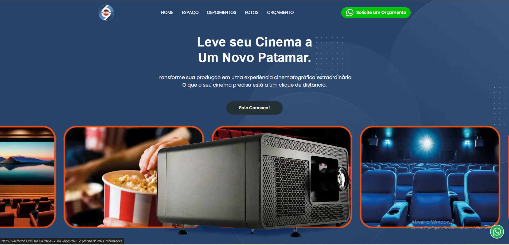

# 🎓 Santa Clara

### Landing page institucional desenvolvida com foco em credibilidade, captação de alunos e fortalecimento da presença digital

🔗 **Demonstração ao vivo:**
https://thiago-tsg.github.io/Santa-Clara/

---

## 📸 Prévia



---

## ✨ Sobre o projeto

O **Santa Clara** é uma landing page institucional desenvolvida para apresentar a proposta educacional da instituição de forma clara, moderna e estratégica.

O projeto foi concebido para fortalecer a comunicação da marca, destacar seus diferenciais pedagógicos e facilitar a conexão entre a instituição e famílias interessadas em conhecer sua metodologia de ensino.

A experiência prioriza a construção de confiança, a valorização dos princípios educacionais e a apresentação dos benefícios oferecidos aos alunos. Conceitos como formação integral, tecnologia aplicada à educação e desenvolvimento humano serviram como base para a estrutura da comunicação digital.

---

## 🎯 Objetivo

Desenvolver uma experiência digital capaz de:

* fortalecer a autoridade institucional da marca
* apresentar a proposta pedagógica de forma objetiva
* valorizar diferenciais educacionais
* aumentar a geração de contatos e matrículas
* proporcionar uma navegação intuitiva em diferentes dispositivos

---

## 💡 Abordagem

O projeto foi estruturado com foco em:

* comunicação clara e acessível
* hierarquia visual orientada à conversão
* valorização dos conteúdos institucionais
* experiência responsiva
* performance e otimização de carregamento

A construção da interface busca conduzir o visitante por uma jornada de descoberta, apresentando a instituição, seus diferenciais e seus valores de forma progressiva e estratégica.

---

## ⚙️ Funcionalidades

* 📱 Layout totalmente responsivo
* 🎨 Estrutura visual institucional moderna
* 🏫 Apresentação da proposta educacional
* 📋 Organização estratégica de conteúdos
* 📞 Chamadas para ação orientadas à conversão
* ⚡ Navegação otimizada
* 🖼️ Exibição de ambientes e diferenciais
* 🚀 Build automatizado para produção

---

## 🧠 Destaques técnicos

### ⚡ Performance

* Minificação de CSS e JavaScript
* Otimização de assets para produção
* Organização eficiente de recursos estáticos
* Estrutura preparada para deploy

### 🎨 Experiência do usuário

* Navegação intuitiva
* Hierarquia visual orientada à conversão
* Layout responsivo para múltiplos dispositivos
* Comunicação institucional estruturada

### 🧱 Arquitetura

* Separação entre ambiente de desenvolvimento e produção
* Estrutura modular de estilos
* Organização de assets e componentes
* Pipeline automatizado com Gulp

---

## 🔄 Fluxo de UX

1. Apresentação institucional
2. Comunicação da proposta de valor
3. Exibição dos diferenciais educacionais
4. Construção de credibilidade
5. Reforço da confiança na marca
6. Conversão através dos canais de contato

---

## 🛠️ Stack Tecnológica

* HTML5
* SCSS
* JavaScript
* Gulp.js
* BrowserSync
* Browserify
* Babel
* Imagemin
* Node.js

---

## 🚀 Como executar

```bash
git clone https://github.com/thiago-tsg/Santa-Clara.git
cd Santa-Clara
npm install
```

### Ambiente de desenvolvimento

```bash
gulp
```

### Build de produção

```bash
gulp build
```

---

## 📦 Pipeline de automação

O projeto utiliza Gulp para automatizar diversas etapas do fluxo de desenvolvimento:

* Compilação de SCSS
* Bundling de JavaScript
* Transpilação com Babel
* Minificação de arquivos
* Conversão e otimização de imagens
* Organização de assets
* Live Reload
* Geração do build final

---

## 👨‍💻 Contexto profissional

Este projeto foi desenvolvido durante minha atuação na **Tecna**, aplicando conceitos de:

* desenvolvimento front-end
* construção de landing pages institucionais
* otimização de performance
* automação de workflows
* organização de projetos para produção
* experiência do usuário voltada à conversão

---

## 👨‍💻 Autor

**Thiago Gonçalves**

* GitHub: https://github.com/thiago-tsg
* Portfólio: https://thiago-tsg.github.io/Portifolio/
* Projeto: https://thiago-tsg.github.io/Santa-Clara/
